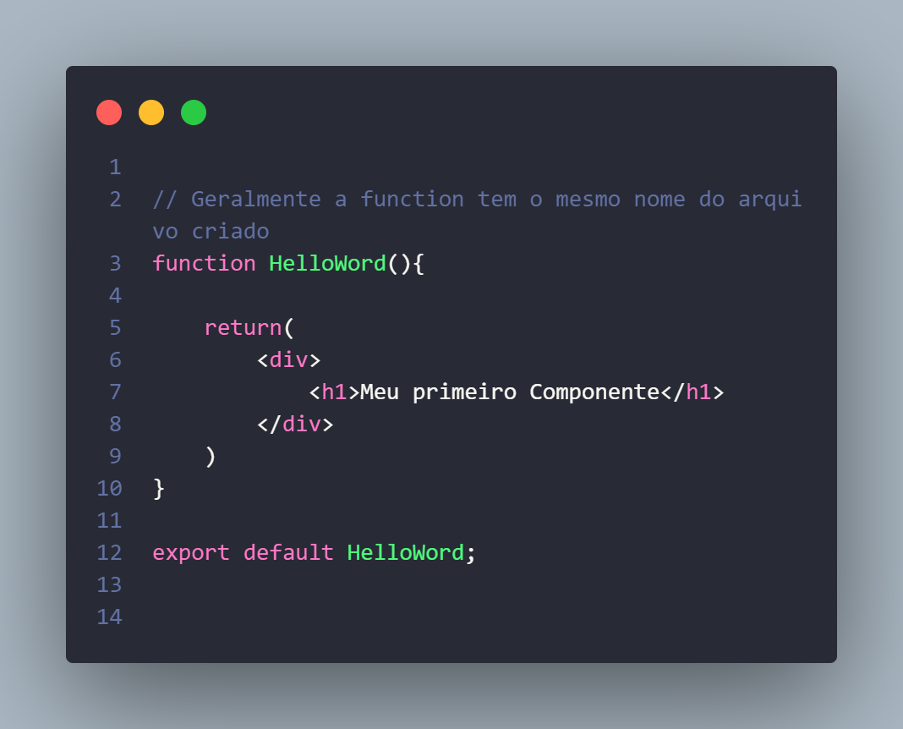
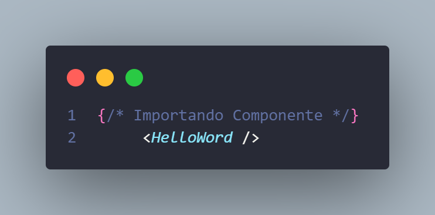

# Começando os estudos sobre REACT

## Anotações
no diretório do projeto, se utiliza:

### `cd (nome do projeto)`
é utilizado este comando no inicio de todo projeto para abrir a pasta do projeto

### `npm start`

Usando esse comando, será aberto um localhost [http://localhost:3000](http://localhost:3000) 
A pagina recarregará sempre que uma alteração for feita e salva

Voce pode sempre verificar se há erros em seu código utilizando o console do navegador

## `Aprendendo o básico de JSX`

Falando de forma simples, JSX é o Html que está juntamente com o JavaScript, podendo fazer a utilizagem de variáveis e equações

## `Aprendendo o básico sobre componentes`

Assim como toda aplicação há JSX, toda aplicação há componentes

Permite dividir a aplicação em partes

Precisamos criar um `arquivo de componentes`
E importa-lo onde precisamos utilizar

Normalmente ficam em uma pasta chamada `components`

Sempre criamos arquivos com a primeira letra de cada palavra em maiúscula,
como se pode ver no exemplo:

componentes podem ser importados e exportados em diferentes arquivos, veja o exemplo:

